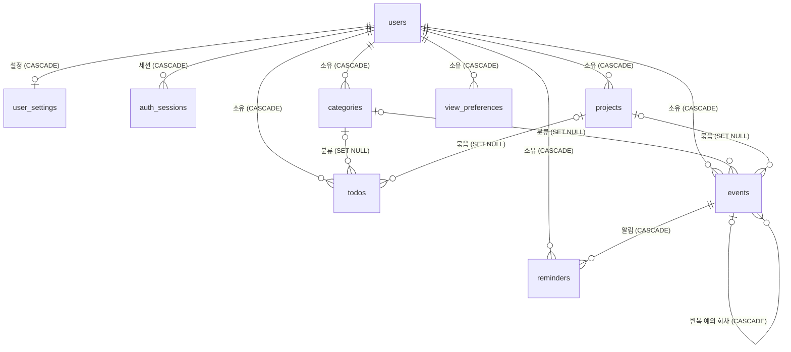

# DOTDAY MySQL 데이터베이스 설계

- DB: MySQL 8.4 (Aiven `defaultdb`, utf8mb4 / utf8mb4_0900_ai_ci, InnoDB)
- 스키마: Flyway 한 파일 `backend/src/main/resources/db/migration/V1__init.sql` (서버 시작 시 1회 적용, 이후 변경은 V2…)
- 접속 정보: 환경변수 `DB_URL`·`DB_USER`·`DB_PASSWORD` (코드·Git 에 없음). 원격 MySQL 은 `sslMode=REQUIRED` 자동 적용

## 테이블

| 테이블 | 용도 | 요청서 대응 |
|---|---|---|
| users | 사용자 (password_hash, name, profile_image_url) | users |
| user_settings | 사용자 설정 (language·timezone·theme·calendar_view·week_start_day·notification_enabled) | user_settings |
| categories | 일정·할 일 공용 분류 (이름, 색) | categories |
| todos | 할 일 | todos |
| events | 일정 (종일·반복·장소·색) | events |
| reminders | 일정 알림 ('N분 전') | reminders |
| projects | 할 일·일정을 묶는 프로젝트 | (기존 기능) |
| auth_sessions | 기기별 로그인 세션 → 이 기기/모든 기기 로그아웃 | (로그아웃) |
| app_admins | 관리자 지정 (DB 에서만) | (운영) |
| seq_counters | 동기화 순번 발급 | (PC↔iPhone 동기화) |
| domain_ops · view_preference_ops | 같은 변경을 두 번 보내도 한 번만 적용 | (오프라인 편집) |
| view_preferences | 테이블 보기 설정 (컬럼·정렬·필터) | (테이블/보기 설정) |

**만들지 않은 것: `recurring_rules`** — 반복은 `events.recurrence_rule` 에 RFC 5545 RRULE 문자열(`FREQ=WEEKLY;INTERVAL=1;BYDAY=MO,WE;UNTIL=20261231`)로 저장한다.
요청서의 frequency·interval_value·days_of_week·end_at 이 RRULE 의 FREQ·INTERVAL·BYDAY·UNTIL/COUNT 에 그대로 대응하고,
앱의 반복 계산(회차 생성·서머타임·단일 회차 수정/취소)이 이미 이 형식으로 구현·테스트되어 있다.
별도 표를 두면 일정과 규칙을 항상 함께 읽고 써야 하고(조인·동기화 단위 증가), 같은 정보가 두 곳에 생긴다.
Google Calendar·iCalendar 도 같은 방식이며, Spring 에서 서버 측 계산이 필요해지면 ical4j 같은 RRULE 라이브러리로 읽을 수 있다.

## 요청 컬럼 ↔ 실제 컬럼

| 요청 | 실제 | 이유 |
|---|---|---|
| user_id | `owner_id` (users·user_settings·auth_sessions 는 `user_id`) | 업무 데이터 전체에 같은 이름 |
| users.last_login_at | `last_sign_in_at` | 탈퇴 재인증(최근 10분 로그인) 판단에 사용 중 |
| todos.completed | `completed` = **status 에서 계산되는 열** (`status = 'done'`) | 앱은 할 일 / 진행 중 / 완료 3단계. 두 값이 어긋날 수 없게 계산 열로 둔다 |
| todos.due_at | `due_date` (DATE) | 앱의 마감은 날짜 단위 |
| todos.priority LOW·MEDIUM·HIGH | `low`·`medium`·`high`·`urgent` + CHECK | 기존 화면 값 유지(긴급 추가). ENUM 대신 문자열+CHECK 로 값 추가가 쉽다 |
| events.recurrence_rule_id | `recurrence_rule` | 위 recurring_rules 참고 |
| events.status | `deleted_at`, `is_cancelled` | 삭제·취소 외의 상태가 없음 |
| reminders.remind_before_minutes / reminder_type | 같음 (+ owner_id, 동기화 열) | 소유권 확인을 조인 없이, 다른 기기와 동기화 |

## 공통 정책

| 항목 | 결정 |
|---|---|
| ID | `CHAR(36)` UUID. 앱이 오프라인에서 ID 를 먼저 만든다(AUTO_INCREMENT 는 서버에 닿기 전엔 ID 가 없음). JPA 에서는 `String id` |
| 테이블명 | 복수형(users, events, todos …). `user`·`event`·`order`·`group` 같은 단수 예약어 충돌 없음. `events` 는 MySQL 비예약 키워드라 이름으로 사용 가능 |
| 삭제 | 업무 데이터는 `deleted_at` 소프트 삭제(기기에서 30일간 복구 가능, 다른 기기에 전달) |
| 동기화 | `version`(충돌 판단), `server_seq`(변경분 커서) |
| 문자셋 | DB 기본값 utf8mb4 / utf8mb4_0900_ai_ci 를 모든 테이블이 그대로 따른다 (한글·이모지) |
| 문자열 리터럴 | 작은따옴표만 (Aiven `sql_mode` 의 `ANSI_QUOTES`) |

## 시간 정책

| 구간 | 형식 |
|---|---|
| DB | `DATETIME(3)` **UTC**. TIMESTAMP 는 2038년 한계와 세션 시간대 자동 변환이 있고 Aiven `time_zone` 이 SYSTEM 이라 쓰지 않는다 |
| Backend | `LocalDateTime`(UTC 기준) / JVM 시간대 UTC 고정. API 는 ISO 8601 `2026-10-07T06:00:00.000Z` |
| Frontend | 받은 UTC 를 사용자 시간대로 변환해 표시 (`Intl`) |
| 사용자 시간대 | 기본 `Asia/Seoul`. `user_settings.timezone`(앱 전체) + `events.timezone`(일정별, 반복·종일 계산 기준) |
| 종일 일정 | `start_at` = 그 시간대의 자정(UTC 로 저장), `end_at` = 다음 날 자정(포함하지 않음) |
| 마감일 | `todos.due_date` DATE (시간대 변환 없음) |

## 관계와 삭제 정책

- **사용자 삭제(회원 탈퇴)**: 고아 데이터가 남지 않도록 소유 데이터 전체를 지운다. 단 아무 때나 지워지지 않게 서버가 막는다:
  최근 10분 안의 로그인(비밀번호 재인증) + 확인 문구 + 관리자 불가. 서버가 한 트랜잭션에서 순서대로 지우고, FK CASCADE 는 마지막 안전망이다.
- **일정·할 일·카테고리 삭제(평소)**: 실제 삭제가 아니라 `deleted_at` 소프트 삭제 → 실수로 지워도 복구할 수 있다.
- **카테고리·프로젝트가 실제로 지워질 때**: 일정·할 일은 남기고 분류만 비운다(SET NULL).
- **일정이 실제로 지워질 때**: 그 알림과 반복 예외 회차는 의미가 없으므로 함께 지운다(CASCADE).

## 인덱스

| 인덱스 | 조회 |
|---|---|
| `events (owner_id, start_at, end_at)` | `owner_id = ? and start_at < :끝 and end_at > :시작` (월간·주간·일간·오늘). 반복 일정은 원본을 따로 읽어 앱이 회차를 계산 |
| `todos (owner_id, completed, due_date)` | 내 할 일 / 미완료(`completed = false`) / 마감일 순 |
| `* (owner_id, server_seq)` | 사용자별 전체 조회 + 동기화 변경분 |
| `users.email` UNIQUE | 로그인 |
| `events (recurrence_parent_id, original_start_at)` UNIQUE | 같은 회차 예외 중복 방지 |
| `reminders (event_id, remind_before_minutes)` UNIQUE | 같은 알림 중복 방지 |
| FK 열 인덱스(category_id 등) | MySQL 이 FK 에 자동 생성 |

`categories (owner_id, name)` 은 UNIQUE 로 두지 않았다: 오프라인 상태의 두 기기가 같은 이름을 각각 만들면 동기화가 거부되어 데이터가 갈 곳을 잃는다.

## 보안

- 비밀번호: BCrypt `password_hash` 만 저장 (평문 없음)
- 토큰: JWT 는 DB 에 저장하지 않음. `auth_sessions` 에는 세션 ID·시각만
- DB 비밀번호·API 키: DB·코드·Git 에 없음 (환경변수)
- 소유권: 모든 조회·변경 SQL 에 `owner_id = 로그인 사용자` 조건 (테스트: 다른 사용자의 행 조회·수정·참조 불가)

## Spring Boot 호환성

- 현재 서버는 Spring JDBC(JdbcTemplate)를 쓴다: 동기화 판정에 행 잠금(`select … for update`)과 순번 발급을 한 트랜잭션에서 다뤄야 해서
- 테이블 구조는 JPA 와도 맞다: 복수형 테이블 + `@Table(name = "todos")`, `String id`(UUID), `LocalDateTime`, `Boolean`, 문자열 상태값은 `@Enumerated(STRING)` 또는 converter
- `todos.completed` 는 계산 열 → JPA 에서는 `@Column(insertable = false, updatable = false)`

## 검증 기록 (2026-10-07)

- Aiven 읽기 전용 점검: MySQL 8.4.8 · `defaultdb` 테이블·PK·FK·인덱스·뷰·루틴·트리거 0개 · Flyway 기록 없음 · TLS 1.3 · `sql_require_primary_key=ON` · `ANSI_QUOTES`
- 로컬 MySQL 8.4.11 을 Aiven 과 같은 `sql_mode`·`sql_require_primary_key` 로 실행해 빈 DB 에 V1 적용 (Aiven 에는 미실행)
  - 13개 테이블 · FK 17 · UNIQUE 3 · CHECK 16 · 인덱스 17 · 모두 utf8mb4_0900_ai_ci
  - 서버 테스트 29개 통과 (가입·로그인·로그아웃, 동기화, 사용자 격리, `completed` 계산 열, 탈퇴 시 알림·설정까지 삭제)
